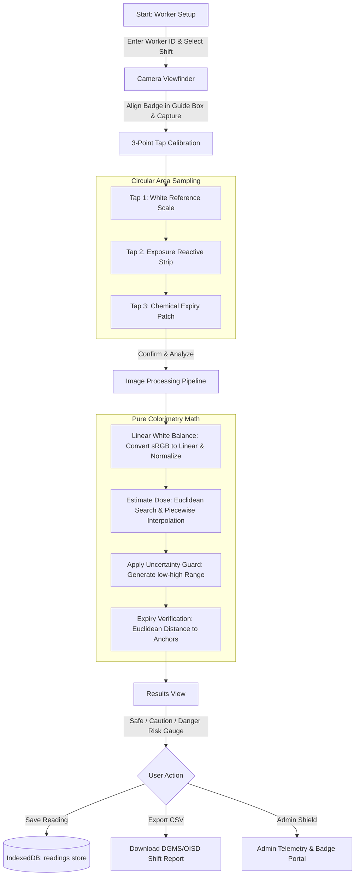

# Setu — H₂S Dosimeter Reader

[](https://vitest.dev/)
[](https://web.dev/progressive-web-apps/)
[](https://developer.mozilla.org/en-US/docs/Web/API/IndexedDB_API)
[](https://www.dgms.gov.in/)

> **Setu** (*Sanskrit for "bridge"*) is a Progressive Web Application (PWA) designed as a digital companion for an indigenous, passive colorimetric Hydrogen Sulfide ($\text{H}_2\text{S}$) dosimeter wristband. It bridges low-cost, zero-electronics chemical sensors with standardized, objective digital optical analysis on frontline workers' smartphones.

---

## ⚠ Safety & Operational Disclaimer

> [!WARNING]
> **Placeholder Calibration Data Notice**  
> The default calibration table (`DEFAULT_CALIBRATION`) and expiry patch anchor coordinates currently bundled in the app are **placeholder synthetic values** for demonstration and development purposes. They do **not** reflect certified chemical titration lab data. A persistent, non-dismissible warning banner is enforced across all application views to prevent reliance for operational safety decisions until real lab calibration datasets are loaded.

---

## Table of Contents

- [Problem & Motivation](#problem--motivation)
- [How the Application Works (End-to-End Flow)](#how-the-application-works-end-to-end-flow)
- [Colorimetry & Mathematical Engine](#colorimetry--mathematical-engine)
  - [1. Linear-Space White Balance Correction](#1-linear-space-white-balance-correction)
  - [2. Dose Estimation & Strict Range Enforcement](#2-dose-estimation--strict-range-enforcement)
  - [3. Chemical Expiry Verification](#3-chemical-expiry-verification)
- [Key Features & Application Views](#key-features--application-views)
  - [Worker Shift Setup & Welcome](#1-worker-shift-setup--welcome)
  - [Live Camera Viewfinder](#2-live-camera-viewfinder)
  - [3-Point Tap-to-Calibrate](#3-3-point-tap-to-calibrate)
  - [Processing & Exposure Results](#4-processing--exposure-results)
  - [Shift History & CSV Export](#5-shift-history--csv-export)
  - [Controlled Lab Experiments Dashboard](#6-controlled-lab-experiments-dashboard)
  - [Admin Telemetry & Badge Control Portal](#7-admin-telemetry--badge-control-portal)
- [Local-First Architecture & Storage](#local-first-architecture--storage)
- [Repository Structure](#repository-structure)
- [Getting Started](#getting-started)
- [Available Scripts](#available-scripts)
- [Regulatory & Compliance Context](#regulatory--compliance-context)

---

## Problem & Motivation

In oil & gas upstream facilities, petrochemical refineries, sewage handling, and underground mining, Hydrogen Sulfide ($\text{H}_2\text{S}$) presents a deadly occupational hazard even at low concentrations. 

- **Limitations of Active Electronic Detectors**: Traditional electronic $\text{H}_2\text{S}$ monitors require regular battery recharging, frequent bump testing, sensor recalibration, and certified intrinsic-safety encapsulation ($Ex/ATEX$), making mass deployment to every contract worker cost-prohibitive.
- **Limitations of Unassisted Passive Badges**: Passive colorimetric chemical strips are affordable, wear-and-forget devices that darken upon reaction with $\text{H}_2\text{S}$. However, human visual inspection under varying ambient lighting (harsh daylight, dim tunnels, yellow sodium-vapor lamps) suffers from high subjective bias and zero auditable logging.

**Setu solves this** by using the worker's or safety supervisor's standard smartphone camera to:
1. Photograph the physical badge containing a printed white reference, chemical exposure strip, and chemical expiry indicator.
2. Mathematically normalize illumination variations in linear photometric space.
3. Compute cumulative exposure dose strictly as an uncertainty-bounded range ($\text{ppm}\cdot\text{h}$).
4. Verify chemical shelf-life validity.
5. Create a timestamped, tamper-evident local audit log exportable for statutory shift compliance (e.g., DGMS / OISD standards).

---

## How the Application Works (End-to-End Flow)



### Operational Workflow

1. **Worker Identification**: The supervisor or worker enters their alphanumeric ID (e.g., `WKR-0042`) and selects the current shift (`Morning`, `Afternoon`, or `Night`).
2. **Badge Alignment & Capture**: The camera viewfinder displays an alignment reticle to position the dosimeter wristband. When snapped, the video frame freezes onto an internal high-resolution canvas.
3. **Interactive 3-Step Sampling**:
   - **Step 1 (White Ref)**: Tap on the printed white patch to capture the ambient lighting profile.
   - **Step 2 (Exposure Strip)**: Tap on the central chemically reactive area that darkens with cumulative $\text{H}_2\text{S}$.
   - **Step 3 (Expiry Patch)**: Tap on the shelf-life indicator patch.
   *(Each tap samples a circular radial neighborhood of pixels and computes the arithmetic mean to reject high-frequency sensor noise).*
4. **Automated Analysis**: The pipeline applies white balancing, runs piecewise dose interpolation, computes minimum uncertainty margins, and evaluates badge freshness.
5. **Dose Display & Safety Logging**: Results are classified into safety tiers, displayed on an interactive risk gauge, and stored in the local IndexedDB database.

---

## Colorimetry & Mathematical Engine

All colorimetric analysis modules in `src/colorimetry/` are implemented as **pure functions** with zero UI or database dependencies, allowing full isolation and automated unit testing.

### 1. Linear-Space White Balance Correction
Standard sRGB color channels apply a non-linear gamma curve ($~2.2$ or $2.4$). Performing color math directly in non-linear sRGB yields severe chromatic distortion under tinted light. 

Setu transforms values into photometric linear space before applying illuminant scaling:

$$\text{sRGB to Linear: } C_{\text{linear}} = \begin{cases} \frac{C_{\text{sRGB}}}{12.92}, & C_{\text{sRGB}} \le 0.04045 \\ \left(\frac{C_{\text{sRGB}} + 0.055}{1.055}\right)^{2.4}, & C_{\text{sRGB}} > 0.04045 \end{cases}$$

For each channel $c \in \{R, G, B\}$, given the sampled raw pixel $C_{\text{raw}}$ and reference white patch $C_{\text{white}}$:

$$C_{\text{corrected, linear}} = \frac{C_{\text{raw, linear}}}{C_{\text{white, linear}}}$$

Then converted back to gamma-compressed sRGB ($0-255$):

$$\text{Linear to sRGB: } C_{\text{sRGB}} = \begin{cases} 12.92 \cdot C, & C \le 0.0031308 \\ 1.055 \cdot C^{1/2.4} - 0.055, & C > 0.0031308 \end{cases}$$

This corrects for yellow sodium-vapor streetlights, warm incandescent bulbs, and daylight casts.

### 2. Dose Estimation & Strict Range Enforcement

> [!IMPORTANT]
> **Safety Rule: Mandatory Range Output**  
> Chemical dosimeters are subject to ambient temperature variations, humidity, and photographic tolerances. In strict adherence to industrial safety standards, **Setu NEVER outputs a single scalar exposure value** (e.g., "12.4 ppm·h"). Every reading must be presented as a lower and upper confidence interval:  
> $$\text{Dose} = [D_{\text{low}}, D_{\text{high}}] \text{ ppm}\cdot\text{h}$$

1. **Distance Metric**: The algorithm calculates the 3D Euclidean distance between the white-balanced strip color $P$ and each calibration node $C_i$ in RGB space:
   $$d_i = \sqrt{(R_p - R_{c,i})^2 + (G_p - G_{c,i})^2 + (B_p - B_{c,i})^2}$$
2. **Piecewise Weighted Interpolation**: The two closest calibration anchors are identified, and a weighted centre estimate $D_{\text{centre}}$ is interpolated.
3. **Uncertainty Expansion**: A $\pm 25\%$ measurement uncertainty is expanded around the centre estimate, clamped to a mandatory floor of at least $0.5\text{ ppm}\cdot\text{h}$:
   $$\Delta = \max(0.5, D_{\text{centre}} \times 0.25)$$
   $$D_{\text{low}} = \max(0, D_{\text{centre}} - \Delta), \quad D_{\text{high}} = D_{\text{centre}} + \Delta$$

#### Risk Exposure Thresholds
- **Safe** ($\le 5.0\text{ ppm}\cdot\text{h}$): Normal shift conditions; worker is within safe exposure limits.
- **Caution** ($5.0 - 20.0\text{ ppm}\cdot\text{h}$): Elevated exposure; investigate fugitive emissions and consider worker rotation.
- **Danger** ($> 20.0\text{ ppm}\cdot\text{h}$): High cumulative dose approaching toxic thresholds; trigger immediate medical evaluation and site ventilation audit.

### 3. Chemical Expiry Verification
To prevent false-negative readings from decayed chemical substrates, the expiry patch is compared against known fresh and expired color coordinates using Euclidean distance in 3D color space:

$$d_{\text{fresh}} = \| P_{\text{expiry}} - P_{\text{anchor, fresh}} \|_2, \quad d_{\text{expired}} = \| P_{\text{expiry}} - P_{\text{anchor, expired}} \|_2$$

- **Status**: $\text{Valid}$ if $d_{\text{fresh}} < d_{\text{expired}}$, else $\text{Expired}$.
- **Confidence Metric**:
  $$\text{Confidence} = \min\left(1.0, \frac{|d_{\text{fresh}} - d_{\text{expired}}|}{\text{Threshold}}\right)$$

---

## Key Features & Application Views

| View | Purpose | Key Functionality |
| :--- | :--- | :--- |
| **1. Welcome / Worker Setup** | Shift initialization | Worker ID validation, shift selector, summary card of previous scan. |
| **2. Camera Viewfinder** | Image capture | WebRTC camera stream, alignment reticle, rear/environment camera preference. |
| **3. Tap-to-Calibrate** | Interactive coordinate mapping | 3-step HUD, circular pixel averaging, live color chip feedback, undo capability. |
| **4. Processing** | Analysis pipeline | Multi-step progress animation for lighting correction, dose interpolation, and validity check. |
| **5. Results Display** | Safety readout | Range readout ($D_{\text{low}} - D_{\text{high}}$), 3-tier risk bar, expiry indicator, raw vs. corrected swatches. |
| **6. History** | Local audit log | Chronological card list with status dots, modal detail view, 1-click CSV export. |
| **7. Experiments** | Lab calibration mode | Calibration run logger (batch ID, chamber ppm, duration, temp, RH), live Canvas darkness-vs-dose chart. |
| **8. Admin Telemetry** | Badge & safety oversight | Telemetry cards, scan success rate, hardware shelf-life monitor, worker search, diagnostics panel. |

### 1. Worker Shift Setup & Welcome
Enforces data integrity before scanning begins: the **Start Capture** button remains disabled until a valid Worker ID is entered. Displays a quick-glance card of the last completed reading.

### 2. Live Camera Viewfinder
Uses WebRTC `navigator.mediaDevices.getUserMedia` requesting the environment (rear) camera. Renders an alignment reticle to help users frame the wristband evenly under uniform light.

### 3. 3-Point Tap-to-Calibrate
Overcomes perspective shifts without requiring heavy optical character recognition or machine learning models. The user taps three locations in sequence:
1. White Reference area
2. Chemically reactive exposure strip
3. Expiry patch

The underlying canvas extracts a circular region of radius $r = \max(10, \min(W, H) \times 0.025)$, averaging all pixels inside the circle:

$$\bar{C} = \frac{1}{N} \sum_{(x,y) \in \text{circle}} C(x, y)$$

Visual numbered badge pins drop onto the canvas at tap locations, and color chip previews update dynamically in the bottom bar.

### 4. Processing & Exposure Results
Displays the computed dose range in large, bold numbers, color-coded by hazard tier (Safe: Green, Caution: Amber, Danger: Red). A smooth risk gauge illustrates the worker's position relative to shift limits. The user can inspect the exact RGB values sampled before and after lighting correction.

### 5. Shift History & CSV Export
Maintains an offline log of all saved readings. Clicking **Export CSV** downloads a structured report formatted for industrial safety auditing:
```csv
timestamp,worker_id,shift,dose_low,dose_high,unit,badge_valid,expiry_confidence
2026-09-04T06:45:00.000Z,"WKR-0042",morning,2.1,3.5,ppm·h,true,0.92
```

### 6. Controlled Lab Experiments Dashboard
Designed for R&D chemists and safety engineers developing the physical dosimeter badges. Allows logging controlled chamber test runs with parameters:
- Batch ID
- Target dose ($\text{ppm}\cdot\text{h}$)
- Exposure duration ($\text{h}$) and chamber concentration ($\text{ppm}$)
- Chamber temperature ($^\circ\text{C}$) and relative humidity ($\%$)
- Measured RGB and darkness metric ($255 - \text{luminance}$)

Features an embedded HTML5 Canvas chart that visualizes the darkness signal response curve across target doses in real time.

### 7. Admin Telemetry & Badge Control Portal
Accessible via the shield icon in the top header. Provides comprehensive plant-wide oversight:
- **Telemetry Metric Cards**: Total scans, scan success percentage, active hardware count, and expiry alerts.
- **Worker Profiles Tab**: Real-time searchable worker records and cumulative shift profiles.
- **Badge Records Tab**: Tracking badge hardware batches and shelf-life degradation.
- **Quality Diagnostics**: System health checks verifying linear lighting correction, range guard suppression, and IndexedDB encryption integrity.

---

## Local-First Architecture & Storage

Setu is designed from the ground up for remote, hazardous industrial environments where internet and cellular connectivity cannot be guaranteed:

1. **Zero Cloud Dependencies**: The application executes entirely client-side. No images, telemetry, or worker data are transmitted to external servers.
2. **IndexedDB Persistence (`idb`)**: Replaced fragile `localStorage` with a robust IndexedDB database (`setu_db`) containing two object stores:
   - `readings`: Worker field logs indexed by timestamp.
   - `experiments`: Controlled laboratory runs indexed by timestamp.
3. **Automatic Legacy Migration**: On launch, the database layer automatically inspects `localStorage` for legacy prototype keys (`setu_readings`, `setu_experiments`) and seamlessly imports them into IndexedDB without data loss.
4. **Service Worker Offline Caching**: `public/sw.js` caches application shell assets, CSS tokens, fonts, and scripts, enabling full functionality in airplane mode.

---

## Repository Structure

```text
h2s_app/
├── public/
│   ├── manifest.webmanifest      # PWA metadata & standalone display configuration
│   └── sw.js                     # Service Worker for offline asset caching
├── src/
│   ├── main.js                   # Application controller & event wiring
│   ├── capture/
│   │   ├── camera.js             # getUserMedia camera stream & frame capture
│   │   └── tapCalibration.js     # Coordinate transformation & circular pixel averaging
│   ├── colorimetry/              # Pure computational engine (100% test coverage)
│   │   ├── colorCorrection.js    # sRGB <-> linear conversion & white-balance scaling
│   │   ├── doseEstimate.js       # Calibration table, interpolation & range enforcement
│   │   └── expiryCheck.js        # Color distance metric for badge freshness
│   ├── storage/
│   │   ├── db.js                 # IndexedDB client with auto-migration from localStorage
│   │   └── csvExport.js          # CSV serialization & browser download trigger
│   ├── ui/
│   │   ├── views.js              # View transitions, DOM renderers & admin telemetry
│   │   └── components/
│   │       └── experimentsChart.js # HTML5 Canvas calibration curve renderer
│   └── styles/
│       ├── tokens.css            # Design system palette, typography & elevation tokens
│       └── app.css               # Responsive layouts, glassmorphism cards & HUD styling
├── tests/
│   └── colorimetry.test.js       # Vitest suite verifying mathematical & safety rules
├── dist/                         # Production build output
├── index.html                    # Modern Vite PWA entrypoint
├── index.singlefile.html         # Zero-build single-file fallback version
├── package.json                  # Dependencies, scripts, and package metadata
├── vite.config.js                # Vite bundler & Vitest test runner configuration
├── AGENT.md                      # Operational guidelines & constraints for coding agents
└── README.md                     # Application documentation
```

---

## Getting Started

### Prerequisites
- **Node.js**: Version 18.0.0 or higher
- **npm**: Version 9.0.0 or higher
- Modern web browser with camera permissions (Chrome, Edge, Safari, Firefox)

### Installation

1. Clone or open the repository directory:
   ```bash
   cd h2s_app
   ```

2. Install dependencies:
   ```bash
   npm install
   ```

3. Start the local development server:
   ```bash
   npm run dev
   ```
   Open your browser at `http://localhost:5173`.

---

## Available Scripts

| Command | Action |
| :--- | :--- |
| `npm run dev` | Starts local development server with Hot Module Replacement (HMR). |
| `npm run build` | Compiles and minifies assets into the production-ready `dist/` directory. |
| `npm run preview` | Locally serves the production bundle from `dist/` for pre-deployment checks. |
| `npm run test` | Executes the Vitest automated test suite for all colorimetry algorithms. |

*(Note: On Windows PowerShell, use `npm.cmd <script>` if script execution policies are restricted).*

---

## Standalone Zero-Build Fallback

For emergency deployment or field demonstrations on devices without Node.js or build tools, the repository includes:

```text
index.singlefile.html
```

This single file contains the entire application (HTML, CSS, JavaScript, icons) bundled into one standalone document. It can be opened directly from a USB drive or local disk in any standard web browser with zero configuration.

---

## Regulatory & Compliance Context

The reporting and uncertainty formats in Setu are structured to align with statutory occupational safety frameworks for toxic gas exposure in industrial and mining operations:

- **DGMS (Directorate General of Mines Safety)**: Mandates documented monitoring of airborne contaminants in subsurface mines and continuous shift logging for individual workers.
- **OISD (Oil Industry Safety Directorate)**: OISD-STD-105 & OISD-GDN-166 guidelines for work permit systems and toxic gas monitoring in hydrocarbons processing.
- **Intrinsically Safe Principle**: By pairing an entirely passive, non-electrical chemical badge with an optical camera readout, Setu eliminates the explosion hazards associated with operating non-certified electrical devices in Zone 0 / Zone 1 hazardous atmospheres.

---

## Design System

The application interface utilizes custom design tokens defined in `src/styles/tokens.css`:

- **Primary Colors**:
  - Ink (Backgrounds): `#171A19`
  - Paper (Text & Accents): `#F2EFE6`
  - Industrial Amber: `#D69A2D` / `#9C6A14`
  - Safety Safe: `#3F6E5C`
  - Safety Danger: `#B0402F`
- **Typography**:
  - Display: `Space Grotesk`
  - UI / Body: `Inter`
  - Data / Status Readouts: `IBM Plex Mono`
